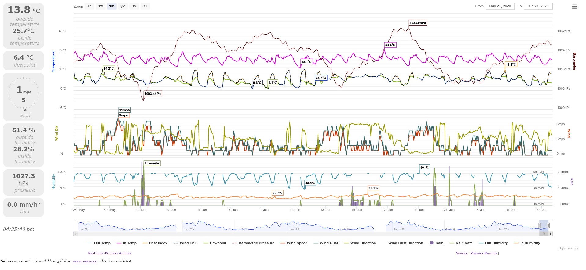
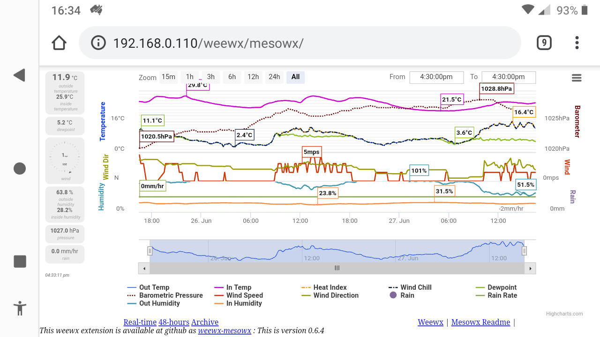

**22nd June 2024**
* We have a fix for [Issue #3](https://github.com/glennmckechnie/weewx-mesowx/issues/8), along with some code tidy up. Thanks go to Bob.
* So, php version 8.x versions are now supported. And anything older can continue to use the [old releases](https://github.com/glennmckechnie/weewx-mesowx/releases)

**27th July 2023**

* Adjust mesowx.py according to Issue #8
   https://github.com/glennmckechnie/weewx-mesowx/issues/8
   It seems that Thread.isAlive() was deprecated in Python 3.7 in favor of is_alive()
   (which has been around since Python v2.6), and removed in Python v3.9.
* While this is an untested fix (by me - I'm still running python 3.7) I note that
  this fix exists in the main weewx code base, and it obviously works for MaffooClock.
  And Thank you MaffooClock for the watchful eyes and heads up.

**17th Sept 2022**

* Code tidy up. 

* Add try for missing server "ConnectionError" fallout. No longer fatal, it should keep running now.
Pending release - updated code is in repo master.

* The original code at https://bitbucket.org/lirpa/mesowx has gone. So this is it!

**25th June 2020**
### Languages

Released as [version 0.6.4](https://github.com/glennmckechnie/weewx-mesowx/releases/tag/v0.6.4)

* text labels are now configurable to accept alternate names or languages.
    mesowx.py, index.html.tmpl, skin.conf and Config.js.tmpl have been tweaked to
    1.) retain a set of english defaults
    2.) read values from the [Language] sections in skin.conf

* No change to skins/mesowx/XXX.inc files, they will still need to be hand edited. They are
    intended to be user configurable anyway.

### Better Bling!

Released as [version 0.6.3](https://github.com/glennmckechnie/weewx-mesowx/releases/tag/v0.6.3)

* split unit configuration into database (auto via weewx.conf) **and** display
    (manual via skin.conf)
* issues ref #2 : change displayed unit inHg for barometer to 'inHg' instead of 'in'
* flag (stats - min/max) colors are now the same as the line colors. They should also be
    visible when near the boundaries (clip : false)
* add optional inTemp and inHumidity sections to mesowx console. We have the room, if we
    have the fields...
* re-add rain to charts. Make dayRain a configurable option from skin.conf (untested, don't
    have one, feed back welcomed!)
* Ratchet up the user configuration in skin.con - 2 default pallets and the previous user
    configurable one
* add chart visibility options to skin.conf. All but inTemp are 'on' to start with.
    outTemp is always on (otherwise the chart generation errors and we get nowhere)
* add modules/exporting.js to add print menu (top right hamburger style)
* there's still an issue #4 with the Humidity flags staying visible
* tweak dayRain config option (untested - no Davis here)

----

Updated the d3, jquery, and highstock libraries.

Adjust css, _index.html_ and _Config.js_ to improve screen usage and allow dynamic rescaling.

Add colors to _sink.conf_ match them to _Config.js_ and update highcharts options to match 8.1.1

See the CHANGELOG.md for a brief summary of changes.

----

**Jun 2020:  Weewx and wee_extension -- DONE!**

The move to use *wee_extension* for the installation process is done. This, along with various updates and easier configuration gives a working default local installation and a far easier process to set up a remote installation (move a directory, rename one file). Testing and feedback is always welcome...

More could be done with this skin and with support and contributions from the community that could still happen. Fork away, contribute back, raise issues. It's not dead yet (it's just sleeping squire.)
# [WeeWX-MesoWx](https://github.com/glennmckechnie/weewx-mesowx)

----

This repo is a fork of MesoWx as originally implemented at [Mesowx](https://bitbucket.org/lirpa/mesowx)

## What is MesoWx

MesoWx is a real-time HTML front-end for visualizing personal weather station data. It provides a real-time graph and console display, and dynamic graphs of your weather station history allowing you to explore the details of any recorded time period in your data.

MesoWx displays data from a database and does not itself interface with any weather station hardware directly, however, being built upon Meso it supports an HTTP API for remotely adding data, which allows integration with existing weather station software. MesoWx integrates well with Weewx and should support any weather station that it supports.

**June 2020:** Time has passed and there are many more excellent and capable skins available for weewx now. They have evolved with the community and are not only well integrated with weewx but feature packed. This one lacks the bells and whistles but is still quite capable at conveying the collected information, thanks to highcharts, decent hardware :-) and access to the whole database.

## History

This repo started with the 0.4.0 version which was the latest available on the 1st February 2018. It has been copied here to enable integration with Luc's raw.py and sync.py scripts
No license was available at the time of upload but Peter Finley (MesoWx author) has indicated that it is [free to use](https://groups.google.com/d/msg/meso-user/ebs6sOhNqsg/iNeqnVarEgAJ)

The lirpa directory now contains the updated scripts as written by Luc Heijst and that were updated/rewritten to keep pace with either the changes in weewx versions, or issues that arose and were reported by weewx users.
Some of those scripts are available in various posts on the weewx-users group. The versions that Luc passed on have been uploaded here as individual commits so viewing the commit history of this repo will show some of the history of the mesowx scripts, after the lirpa repo stopped  development.

Those scripts and associated contents have been tweaked to enable the weewx installer to control the installation process. The use of wee_extension vastly improves the installation process and mesowx configuration and should go someway towards keeping MesoWx alive and current.

Previously it took a lot of effort to modify Mesowx to personal taste. The default local (Raw) installation will just run once installed and the RemoteSync version is in a state where a cut, paste and a file rename will get it into a working state (the database setup does involve a few more steps. Ah well!) Configuration is predominately via _weewx.conf_ and _skin.conf_

## Limitations

 1. A modern web browser is required for the out of the box front-end (Chrome, Firefox, Safari, IE10+)
 2. Extremely large archive databases likely won't perform very well at the moment (my archive database contains 350,000+ records and has performed adequately), especially on a low power server.
 3. To record the raw (loop) packets it uses mysql, these days MQTT has filled that niche and is far better suited to it. This skin does not use MQTT.

## Warnings

This software may be dated, but it is still functional. It fills a niche for me, and possibly for others. It was also a long term objective on my part to see if it could be managed by *wee_extension*, and that's one itch that has now been scratched!

The old caveat of there being **NO** update path still applies. However the new script - _mesowx.py_ - hasn't really changed that much, only the way it's called. If you have a working install then don't blow that away, the script should still work with it, you'll just need to call different sections of it if you decide to update to this weewx4/python3 compatible version.
So, Backup your existing version, don't overwrite it. Install this one in parallel, in its new location, and then copy your changes over. If it's index.html changes then a drop in could work. If it's the config files then weewx.conf will need tweaking. If it's the script then you'll need some python knowledge to sort out the redirection.

If that all seems too hard then contact me via github and we'll see what we can work out.

----

# Weewx and wee_extension -- DONE!

**Jun 2020**
The move to weewx via *wee_extension* is done, it needs some beta testing...

*wee_extension* will install and configure this skin as much as it can. More could be done with the integration and with support and contributions from the community that could still happen.

The 3 original mesowx scripts have been combined into one script which are all installed as a SLE - a skin named Mesowx, a script named _mesowx.py_ and a database named mesowx.

Because it has control over the local setup ... **[Mesowx][[Raw]]** ... you will find that version fully configured and ready to view in your browser at http://localhost/weewx/mesowx/

The skin is populated with values sourced from _weewx.conf_ and from _install.py_. It applies them to both the Raw and RemoteSync versions.

It also generates the two unique security keys that are required for the RemoteSync version.

# Install, then configure

I've been more rigourous with packaging up the point releases as something meaningful and trackable (especially if I break something). That's made that page fairly busy but it offers a good way of tracking the changes, especially for the switch to v0.6.X where the change to d3, highcharts and jquery library was made.

    wget -O weewx-mesowx.zip https://github.com/glennmckechnie/weewx-mesowx/archive/master.zip
    wee_extension --install weewx-mesowx.zip

## Configuration values in weewx.conf and skin.conf

The supplied values, except for the **remote_server_url** and the **polling_interval** can all be left as they are.

Your values for the *raw_security_key* and *archive_security_key* will be different. Those are auto generated by the installer and will be unique for every installation. You can change them if you like, and then wait for your values to propagate through to the webserver files - all before you transfer the files etc. to the remote server.

The remote server URL obviously needs changing.

The polling interval sets the refresh time in seconds (converted to milliseconds) 60 is the default. I use 20 for the 1-wire setup. It's up to you and your station.

**skip_loop** sets the time allowed between loop packets. If you get them every 2 seconds and you want to change that to every 20 seconds, then the 2 becomes 20.
If you already get them every 20 seconds, then the default value of 2 seconds will have no affect. Leave it or increase it if 20 seconds is still too frequent. It's your choice.

The **data_limit** is the number of hours of records to keep in the raw database, anything older than that are deleted. It is also used in the 24-hour range. If you opt for 48 then it should display 48 hours of raw records (rather than the default of 24-Hours)

    # Options for extension 'mesowx'

    [Mesowx]
       loop_polling_interval = 60
       [[RemoteSync]]
            raw_entity_id = weewx_raw
            remote_server_url = http://remote_server_address/weewx/mesowx/meso/
            raw_security_key = gQVAtmzFP6XkwlCdiUi
            archive_entity_id = weewx_archive
            archive_security_key = w29VxwOOzJYQxnKa3h
        [[Raw]]
            data_binding = mesowx_binding
            data_limit = 48
            skip_loop = 2

ChartColors is a dict of values in the _Mesowx/skin.conf_ file which are used by the SLE (CheetahGenerator ) to populate the colors in _skins/Mesowx/js/Config.js.tmpl_, which then becomes _mesowx/js/Config.js_
You can now easily get rid of my values and choose your own!

    [ChartColors]
        # These are the color codes used in Config.js to define the chart lines and
        # the chart names.
        # To change these colors, and have them take affect, you will need to have
        # the skin set to enable in weewx.conf, ie:- under [Mesowx] enable = True
        #
        # One of many ... https://www.rapidtables.com/web/color/Web_Safe.html

        out_temp = '#0033FF'
        bar_ometer = '#660000'
        wind_speed = '#CC3300'
        wind_dir = '#999900'
        r_ain = '#80699B'
        rain_rate = '#89A54E'
        out_humidity = '#3D96AE'
        in_temp = '#CC00CC'
        dew_point = '#8BBC21'
        wind_chill = '#0d233A'
        heat_index = '#FF9900'
        wind_gust = '#336666'
        wind_gustdir = '#B5CA92'
        day_rain = '#0D233A'
        in_humidity = '#F28F43'

## Local Installation.

The local (Raw) mesowx database will be automatically generated and consists of just the raw (loop) table. The archive (REC) values will be sourced from your existing mysql weewx database.

Once all the mesowx files are generated (at last count there were 51 of them) and transferred to your local web server the **[StdReport][[Mesowx]]** skin can be disabled by changing the _enable = True_ stanza to...

    enable = False

#### Why False?

A working installation does not require that skin to be regenerated each report interval.

If the defaults work for you then it can be disabled after the first 1 or 2 cycles.

However, if you want to tinker with colors (available via _skin.conf_), change any of the **[Mesowx]** entries in weewx.conf, or experiment with the server files (remember the _XXXX*.tmpl_ files are the source files) then you'll need to renable the skin to allow those config files to be recreated, or your new files to be the source files.
If you make changes to the webserver files with the skin disabled (_enable = False_) then those changes run the risk of being overwritten if you re-enable the skin and forget what you've done (time passes for us all and memories fade!).

## Remote Installation.

The local (Raw) installation is setup to run once weewx is restarted.

The RemoteSync installation is not. To get weewx to run this section of the script you will need to manually edit the weewx.conf file by appending **user.mesowx.SyncService** to the end of restful_services, located under the **[Engine][[Services]]** section

    [...]

    [Engine]
        [[Services]]
              [...]
              restful_services = [...], user.mesowx.SyncService
              [...]

If and when you uninstall MesoWX, that entry will need to be removed.

Likewise, if you don't want the local (Raw) version of Mesowx running then remove...

    , user.mesowx.RawService

from the end of the archive_services = [...] line.

The RemoteSync version will also need action on your part as all the files that are generated and transferred to the local web server need to be transferred to your remote web server. This is the exact same directory and structure as the local, Raw version uses.  (ie:- That _www/html/weewx/mesowx_ directory is fully portable.)

Copy that whole mesowx directory to your remote webserver and then; once all the files and directories are moved to that remote machine; then rename _config-RemoteSync.json_ to _config.json_ to allow that remote installation to work correctly.

ie:- the file...

       mesowx/meso/include/config-RemoteSync.json

needs to be renamed as...

       mesowx/meso/include/config.json

With that done you should have a working webserver installation; once the database is created and populated with data then you will know for certain.

### Databases and Passwords

The "host", "user", "password", and "database" configuration values preset in mesowx/meso/include/config.json are provided to give you a working installation on a machine you have total control over. 

In this first case, where it could be a home network, or a server in your DMZ; the only setting that is system specific is "host". That needs to match what your mysql installation expects and that's most likely to be "localhost". The "user", "password", and "database" values are entirely up to you. Change them if you want to, or leave them as they are.

On the otherhand, If you are using a hosting provider that provides their own generated values, ones that are specific to your account, then you obviously need to use those values.
Edit the config.json file you renamed above and upload that, overwriting the previous version.

On the subject of hosting providers. You get what you pay for and at least one of the 'free' hosting providers won't allow a service such as mesowx to run (on their free accounts). See [issue #6](https://github.com/glennmckechnie/weewx-mesowx/issues/6) at the github site for the full details but basically they intercept the call to data.php and inject there own code (a cookie generator) which mesowx doesn't expect, and can't deal with (as the providers intended).

Also, keep in mind the traffic usage with the Free providers. You're uploading your archive records every archive interval, and your LOOP packets as often as they are generated. This has the potential to add up very quickly and if you are rate limited then you may hit the wall and the only sign will be a gap/s in data.

## Enhance or Break??

Okay, You now have a working setup, but it makes a few assumptions about fields and units. These can all be modified but you might end up with some breakage.
As of version 0.5.1 the installer will adjust the units it can according to the configuration of the target_units setting defined in weewx.conf ie: US, METRICWX or METRIC. You may want to refine them further and it is here that it is done (after the skin is disabled, otherwise your edits will be overwritten.)

As configured, it will only use the database fields as hardcoded within the file _config.json_

They are listed under "columns", in two places. Here's the one at line 58 for the archive table...

            "columns" : {
                "dateTime" :    {"type" : "number", "unit" : "s"},
                "interval" :    {},
                "barometer" :   {"unit" : "$press"},
                "inTemp" :      {"unit" : "$degr"},
                "outTemp" :     {"unit" : "$degr"},
                "inHumidity" :  {"unit" : "perc"},
                "outHumidity" : {"unit" : "perc"},
                "windSpeed" :   {"unit" : "$speed"},
                "windDir" :     {"unit" : "deg"},
                "windGust" :    {"unit" : "$speed"},
                "windGustDir" : {"unit" : "deg"},
                "rainRate" :    {"unit" : "$rainR"},
                "rain" :        {"unit" : "$meas"},
                "dewpoint" :    {"unit" : "$degr"},
                "windchill" :   {"unit" : "$degr"},
                "heatindex" :   {"unit" : "$degr"}
            },

then again at line 107 for the raw (loop) values.  The units will default to the value detected in _weewx.conf_

If you are going to add fields that will be fine, you don't have to use them. However those edits need to be done before you create the remote database or allow it to be populated. It can't create what it doesn't know about.

The other location that will need to be modified is under _mesowx/js/Config.js_ and these units and there formatting will also be modified according to the weewx defaults in _weewx.conf_

    Config.fieldDefaults = {
      'dateTime':     new meso.FieldDef('dateTime',   meso.Unit.ms,       0,    meso.Agg.avg),
      'outTemp':      new meso.FieldDef('outTemp',    mesowx.Unit.$degr,  1,    meso.Agg.avg, 'Out Temp'),
      'dewpoint':     new meso.FieldDef('dewpoint',   mesowx.Unit.$degr,  1,    meso.Agg.avg, 'Dewpoint'),
      'rain':         new meso.FieldDef('rain',       mesowx.Unit.$meas,  $m_f, meso.Agg.sum, 'Rain'),
      'rainRate':     new meso.FieldDef('rainRate',   mesowx.Unit.$rainR, $m_f, meso.Agg.max, 'Rain Rate'),
      'dayRain':      new meso.FieldDef('dayRain',    mesowx.Unit.$meas,  $m_f, meso.Agg.max, 'Rain Today'),
      'windSpeed':    new meso.FieldDef('windSpeed',  mesowx.Unit.$speed, 0,    meso.Agg.avg, 'Wind Speed'),
      'windDir':      new meso.FieldDef('windDir',    mesowx.Unit.deg,    0,    meso.Agg.avg, 'Wind Direction'),
      'windGust':     new meso.FieldDef('windGust',   mesowx.Unit.$speed, 0,    meso.Agg.avg, 'Wind Gust'),
      'windGustDir':  new meso.FieldDef('windGustDir',mesowx.Unit.deg,    0,    meso.Agg.avg, 'Wind Gust Direction'),
      'outHumidity':  new meso.FieldDef('outHumidity',mesowx.Unit.perc,   1,    meso.Agg.avg, 'Out Humidity'),
      'barometer':    new meso.FieldDef('barometer',  mesowx.Unit.$press, $p_f, meso.Agg.avg, 'Barometric Pressure'),
      'windchill':    new meso.FieldDef('windchill',  mesowx.Unit.$degr,  1,    meso.Agg.avg, 'Wind Chill'),
      'heatindex':    new meso.FieldDef('heatindex',  mesowx.Unit.$degr,  1,    meso.Agg.avg, 'Heat Index'),
      'inTemp':       new meso.FieldDef('inTemp',     mesowx.Unit.$degr,  1,    meso.Agg.avg, 'In Temp'),
      'inHumidity':   new meso.FieldDef('inHumidity', mesowx.Unit.perc,   1,    meso.Agg.avg, 'In Humidity')
     };

If you change any of these defaults, by editing these files directly; then be very careful as typos can be silent code breakers.

Take a backup (as you always do ?) and use a lot of care.

### I tweaked some values and "It doesn't work"

See the Troubleshooting section below. :-)

## Testing the default installation
                 (ie: excluding the above modifications).

A quick test of the configuration is to point the browser to the remote site using...

http://remote_server_address/weewx/mesowx/meso/data.php?entity_id=weewx_archive&data=dateTime&order=desc&limit=1

and a date should be returned if the database has something...

       [[1592045160]]

A database with nothing in it will return...

       []

A database that doesn't exist will throw a Fatal error...

       Fatal error: Uncaught PDOException: SQLSTATE[HY000] [1049] Unknown database
       [...]
        /var/www/html/weewx/mesowx/meso/include/PDOConnectionFactory.class.php on
       line 31

To create the remote database and give the appropriate permissions that match the wee_extension installation values, then...

       mysql -uroot -p
       create database mesowx;
       GRANT select, update, create, delete, insert ON mesowx.* TO mesowx@'localhost' IDENTIFIED BY 'weewx';
       quit;

The remote mysql database - mesowx - contains 2 tables; archive and raw (weewx via the _mesowx.py_ script, will create those).

A large database will take a lot to create via the backfill method.

For this reason the archive section should be copied from your existing weewx database via a mysqldump command, or other means.

If that doesn't worry you, or if it's a machine that you can see from your chair (ie: it's local and an ultra low ping away) then mesowx.py can be used to backfill an empty database. It can take a long time (just how long is a piece of string?) to complete when you start from scratch.

If it's too large it may even refuse, or your machine may be brought to it's knees while the database is being queried (admittedly if you survive that step it does get better).

While it's doing that long backfill, weewx will be stalled, that's no records generated, no graphs, nothing, nada, zilch. The only activity may be in your logs - if debug is turned on.

Once the database is populated (or starting to be) then pointing your browser to the remote machines webserver _mesowx/index.html_ file should result in a working mesowx website.

# To repeat:
           Use wee_extension to install MesoWX.
           Enable user.mesowx.SyncService by adding it to restful_services
           Restart weewx
           Wait for a report cycle, or two, to generate the <web server>/mesowx
               directory
           Copy that webserver mesowx directory and its sub directories and files
               from the local webserver and place them into the remote servers
               path - keep the same directory paths as the local installation,
               unless you know what you are doing.
           That will have created the remote website. Make sure the permissions
               are correct.
           Create the remote database, with permissions.
           Populate the remote database with the archive table from weewxs
               database, (that's all it requires from that database. The raw table
               will be created when he first loop value hits it.)
           Check the weewx.conf values are correct - pay attention to the site URL
               (Review the above hint)
           Turn off the skin generation, with a working setup it is no longer
              required. [StdReport] [[Mesowx]] enable = False
           Restart weewx with debug turned on (debug = 1)
           Check your logs. That will be syslog and your apache2 logs (or webserver
              of choice logs)
           Wait.

# Further notes:

The backfill operation will perform a bulk transfer of historical records. It only runs on weewx start up and only deals with archive (REC) records.
You basically get one chance to do a (database) backfill operation.

Obviously, if you stop weewx (or remove the RemoteSync call), lose your internet connection or some other action interferes with the transfer then you'll need to delete the remote (NB that's the remote!) database contents (that's the incomplete, unimportant one) and start again. The transfer via a backfill method can't be interrupted without records going missing.
ie: stop weewx, empty the **remote** database, restart weewx, watch the transfer ... rinse, repeat.

### Why is this so?
After that backfill operation has finished (or been interrupted and come good after the backfill has finished or given up) the weewx record event Queue takes over and archive and/or loop values will be available as weewx generates them. These are syphoned off and sent to the mesowx database/s

If the data flow to the remote server is interrupted, those records will be permanently dropped. Loop are stored in their own Queue but other than that they aren't kept anywhere else. Archive records will be available from the weewx database and the archive Queue but if the connection comes good, the Queue will send what it has regardless of what is missing and the next query for the latest_date_time knows nothing about dropped, or older, records.

(Loop values are already restricted to a 24 hour period before they are deleted from the database although 24 hours can be overridden in the weewx.conf [[Raw]] section).

#### To recap, or in short...
Restarting weewx will start the backfill operation again but if a current archive packet has been written to the remote database then as far as the backfill operation knows, all is golden. There is nothing for it to do.

If you are certain there are gaps in the remote data, then you need to fill them manually. You could do a mysqldump style operation, or...

You can stop weewx, delete everything at the remote end that covers the missing data upto the present time; then start weewx and the backfill process should pick up on that deletion and perform the required backfill.

And that's how it goes with a Remote installation, we are at the mercy of our internet connection.

A local installation doesn't suffer from this problem, the databases stay current (if they don't we have far bigger problems !)

## README's
There are 2 README files in the github repo (also in the downloaded zip file).  If you have problems read those. They cover the history of the setup and while out of date they may fill in some knowledge gaps.

There is also this README available from your Mesowx installation. Edit the _links.inc_ file if required.

RetainLoopValues.py is not a file I've ever used. It's included within this script, nothings been changed except to incorporate it as a function.

# Security: !!!

You are responsible for the security of your webserver and mysql database.

The installer will generate 2 random passwords and insert them into the script as well as the relevant config files. If you don't trust them change them but don't make any typos in the process or you will break the remote access granted to weewx and the database. They are truly random keys, check the install.py file for the 'secret' to their generation.

With those passwords (entity_keys), and others that could be available to anyone with webserver access, you need to prevent them being read.  For the apache2 installation here I've added the following to _/etc/apache2/apache2.conf_ to prevent any files being accessed that are not _index.html_

       <Directory /var/www/html/weewx/mesowx>
               Options -Indexes
               AllowOverride None
               Require all granted
       </Directory>

You will need to do the same, or similar depending on your webserver and installation. You'll then check that it does what is intended.

# Finally:

Bug reports to github...

       https://github.com/glennmckechnie/weewx-mesowx

       Comments, enhancements, code for conversion to use MQTT :-))
       Send them to github. Failing that weewx-user.

----

# Original design notes for SyncService.

       archive sync:
         premise
           data always sent in sequential order
           failures aren't tolerated (will either fail or retry forever on all
            errors)
         thread
           watches queue and publishes data to remote server in order
           IO failures result in a retry after X seconds, indefinitely
         back_fill
           on start up
             query remote server for most recent date
             sync all records since date to queue
           new archive packets
             date of packet added to queue (have to make sure it's not already
              sent by the back_fill)

       raw sync:
         premise
           data sent immediately from packet (not db)
           failures are tolerated (errors will skip)
         thread
           watches queue and publishes data to remote server
           IO failures are logged and skipped

       error handling
         3 general categories of errors:
           1) can't communicate w/server (IO)
           2) configuration/logical error (400 status response)
           3) unknown/unexpected error (500 status)
         all errors are possible when initially setting it up, but only #1
           and possibly #3 should occur after that, thus always fail for #2,
           and retry for #1 and #3

# Troubleshooting

Modifying the source files can introduce errors.

If you're greeted with a blank page, or something that's less than expected, then you've made a typo in one of your edits. Probably as small as a misplaced comma, or even a character in the wrong spot.

Keeping backup copies of the files you are working on is essential. Using the command _diff_ to detect differences between files is great, but personally I use **vim -d file_name.py file_name.py.bup** as that will show the differences very clearly and allow the fix to be made on the spot. Explore your editor and see if it has a similar option.

Watching the log files, syslog and webserver logs is also an essential requirment. **multitail -f /var/log/apache2/access.log /var/log/apache2/error.log** works for me (hit the enter key to add a colored marker line to multitail) as while the messages amy be cryptic, it's better than nothing and are always useful as clues.

Finally, Use your browsers **Inspect Element** option.

Right click on the web page, click on **Inspect Element**, switch to the **Console**, refresh the page and start exploring the results that are returned. (Hint, it's the red ones that matter :) Clicking on the filename associated with the message will be enlightening.)

----

#### The following is from the README-lirpa.md, the original notes included when Mesowx was first released. They are still relevant

Check your web server/PHP logs for errors. Make sure that logging is enabled in your _php.ini_
To confirm, check your 'php.ini' for the following directives:

* [log_errors](http://www.php.net/manual/en/errorfunc.configuration.php#ini.log-errors) enabled
* [error_log](http://www.php.net/manual/en/errorfunc.configuration.php#ini.error-log) where to look for logs
* [error_reporting](http://www.php.net/manual/en/errorfunc.configuration.php#ini.error-reporting) should be set to 'E_ALL & ~E_NOTICE & ~E_STRICT & ~E_DEPRECATED'

To help pinpoint the issues, it can be helpful to inspect the browser network traffic using a development tool.
Use "Inspect Element" in Firefox and keep an eye out for javascript errors. Using these tools you can inspect the HTTP responses.
For more details about what the root cause may be.

mesowx.py errors will be logged to syslog. Try putting Weewx in debug mode (set 'debug=1' in your weewx.conf) to gather more information.

----
# HALT, before you continue reading, take note.
----
#### The above guide applies to this github version and should be all that you need for a successful install. If it isn't I'd like to know so that it can be fixed.
----
# The following is the OLD Installation Guide
----
#### Everything below is for history, and is included just in case I've skimmed / missed / assumed something.
#### These were relevant for the original separate scripts as maintained by Luc for use with weewx 3.X, they are not so relevant now.
----

There are two primary ways that MesoWx can be setup. The configuration needed revolves around where your weather station database resides:

### Shared database
To be able to use this setup your web server must be able to access your weather station database, or you have done your own database synchronization using some other process

### Remote database
 In this setup, your web server has no access to your weather station database, so remote integration and data synchronization is necessary.
 For this setup, we'll assume that you'll be leveraging the HTTP APIs provided by Meso to synchronize your data to a local database.

These instructions will help guide the configuration for your needs. Please determine your desired/necessary setup path and note the specific instructions for each below. The initial setup is all about getting your data accessible for consumption by MesoWx.

Install Prerequisites

MesoWx requires a web server with PHP and a database. You must first install the following:

 1.   A web server that supports PHP (e.g. Apache HTTP server, Nginx)
 2.   PHP 5.4+ w/MySQL PDO (PDO is typically installed by default) and JSON
 3.   MySQL 5+ (For remote database setup only)

How to install and manage these is outside the scope of these instructions.

# Database Setup

If your weather station database isn't available to your web server (remote database setup), you'll need to setup a database that it can access and where you will synchronize your remote data. If you web server can access your weather station database, you may still want to create a separate database user for MesoWx to access your database.

To create a database to house your data (remote database setup only):

    mysql -uroot -p
    mysql> create database mesowx;

To create a user with access to this database (this example reuses the weewx user and password):

    mysql> CREATE USER 'mesowx'@'localhost' IDENTIFIED BY 'mesowx';

Grant full access to your remote database (if you are using a remote database setup, which will be with sync.py):

    mysql> GRANT select, update, create, delete, insert ON mesowx.* TO mesowx@localhost;

Grant read only access to your local database (note: only needed for shared database setup, replace "DATABASE" with your database name. raw.py will be the script used here):

    mysql> GRANT select ON "DATABASE".* TO mesowx@localhost;

# Install MesoWx

  1.  Expose the web folder via your web server
  2.  Once done, you can test by trying to access /js/Config-example.js in a browser.
  3.  Also make sure that the /meso/include/.htaccess file is being applied by trying to access the configuration file /meso/include/config-example.json in a browser. If not using Apache, use a similar means to prevent access to the files in the include folder. This is extremely important for protecting your configuration file which includes your database credentials.

# Configure Meso

Meso is included in meso sub-directory within MesoWx's web directory and has it's own configuration file. An example configuration file exists in web/meso/include/ named config-example.json. It is stubbed for a typical Weewx integration and includes documentation explaining the various options. The actual configuration file must be named config.json and should be in the same directory. You can rename or make a copy of the example file to use as a starting point. See the comments in the example file for further instructions on how to configure Meso for MesoWx, and refer to the Meso documentation for further assistance.

# Configure MesoWx

An example MesoWx configuration is defined in /web/js/Config-example.js. The actual configuration file must be named Config.js and live in the same directly. You can rename or make a copy of this file to use as a starting point. See the comments in the example file for further explainations of the various configuration options.

Next, either rename or make a copy of the /web/index-example.html and call it index.html. This file contains the HTML markup and core containers for the user interface and can be customized, if desired, but knowledge of HTML and CSS is necessary. See the comments in the file for some easy tweaks that could be made depending on your weather station. If you're wanting to customize the CSS style, it's recommended to create a new CSS file rather than editing mesowx.css, so that future updates don't overwrite your changes.

# Weewx Plugins

The following notes are taken from [Lucs instructions on weewx-user](https://groups.google.com/d/msg/weewx-user/eAUsTqR8yYQ/UVMxAAtgAAAJ) for the raw.py script

The [sync plugin](https://groups.google.com/d/msg/weewx-user/DnaWsMpC9vE/RfcC5KwQAgAJ) notes for later inclusion.

# Raw

## For weewx
Edit weewx.conf
The addition of a raw section which will read as follows

    ##############################################################################

    [Raw]

        #
        # This section is for configuration of the raw plugin. This plugin stores the raw
        # data off of the station.
        #
        # The database binding to persist the raw data. 
        # This should match a section under the [DataBindings] section.
        data_binding = raw_binding
        #
        # The max amount of raw data to retain specified in hours (set to None to retain all data)
        # This will in effect keep a rolling window of the data removing old data based on 
        # the time of the most recent record. It is recommended to set this to at least 24.
        #
        # NOTE: if increasing this value (or use None to keep forever), 
        # keep in mind that raw data may consume VERY large amounts of space!
        data_limit = 24

    ##############################################################################  

Add a section [[raw_binding]] to the [DataBindings] section

    [DataBindings]
         [[raw_binding]]
            database = raw_mysql
            table_name = raw
            manager = weewx.manager.Manager
            schema = user.raw.schema

Add a section [[raw_mysql]] to the [Databases] section

    [Databases]
        [[raw_mysql]]
            database_type = MySQL
            database_name = mesowx

## For mesowx

Edit [your local webserver directory]/mesowx/meso/include/Config.json

    "dataSource" : {
        "weewx_mysql" : { // the data source ID
            "type" : "mysql",
            "host" : "localhost",
            "user" : "weewx",       // NOTE: Your mysql username/passwords must be the same as in the
            "password" : "weewx",   // [[MySQL]] section of section [DatabaseTypes] in weewx.conf
            "database" : "weewx"
        },
        "raw_mysql" : { // the data source ID
            "type" : "mysql",
            "host" : "localhost",
            "user" : "weewx",       // NOTE: Your mysql username/passwords must be the same as in the
            "password" : "weewx",   // [[MySQL]] section of section [DatabaseTypes] in weewx.conf
            "database" : "mesowx"
        }
    },

    "entity" : {
        // This entity definition is for a typical Weewx archive table.
        "weewx_archive" : { // the entity ID

NOTE: the following settings depend on the target_unit setting in section [StdConvert]
WARNING: Check the "columns" sections below; add or remove fields when needed

when target_unit = US:

    "columns" : {
                "dateTime" :    {"type" : "number", "unit" : "s"},
                "interval" :    {},
                "barometer" :   {"unit" : "inHg"},
                "inTemp" :      {"unit" : "f"},
                "outTemp" :     {"unit" : "f"},
                "inHumidity" :  {"unit" : "perc"},
                "outHumidity" : {"unit" : "perc"},
                "windSpeed" :   {"unit" : "mph"},
                "windDir" :     {"unit" : "deg"},
                "windGust" :    {"unit" : "mph"},
                "windGustDir" : {"unit" : "deg"},
                "rainRate" :    {"unit" : "inHr"},
                "rain" :        {"unit" : "in"},
                "dewpoint" :    {"unit" : "f"},
                "windchill" :   {"unit" : "f"},
                "heatindex" :   {"unit" : "f"}
            },

when target_unit = METRIC:

    "columns" : {
                "dateTime" :    {"type" : "number", "unit" : "s"},
                "interval" :    {},
                "barometer" :   {"unit" : "hPa"},
                "inTemp" :      {"unit" : "c"},
                "outTemp" :     {"unit" : "c"},
                "inHumidity" :  {"unit" : "perc"},
                "outHumidity" : {"unit" : "perc"},
                "windSpeed" :   {"unit" : "kph"},
                "windDir" :     {"unit" : "deg"},
                "windGust" :    {"unit" : "kph"},
                "windGustDir" : {"unit" : "deg"},
                "rainRate" :    {"unit" : "cmHr"},
                "rain" :        {"unit" : "cm"},
                "dewpoint" :    {"unit" : "c"},
                "windchill" :   {"unit" : "c"},
                "heatindex" :   {"unit" : "c"}
            },
            // constraints on the data, only primaryKey is supported currently
            "constraints" : {
                // The primary key column of the table. Currently only a single column key is 
                // supported and this column must also be a date time value stored as seconds/ms
                // since epoch.
                "primaryKey" : "dateTime"
            }
        },
        // This example shows a configuration with a retention policy
        "weewx_raw" : {
            "type" : "table",
            "dataSource" : "raw_mysql",
            "tableName" : "raw",
            "accessControl" : {
                "update" : {
                    "allow" : true,
                    "securityKey" : ""
                }
            },
            // The retention policy defines how this data is retained over time. It is only really
            // revevant when allowing this entity to be updated. Curently the only supported
            // policy type is "window" which will retain data within the specified time window.
            "retentionPolicy" : {
                "type" : "window",
                // The trigger defines when the policy is applied. Currently only "update" is
                // supported, which means each time the entity is updated.
                "trigger" : "update",
                // The amount of time in seconds since the current date/time to retain. All records
                // before this time window will be permanently deleted!
                "windowSize" : 86400  // 24 hours)
            },

NOTE: the following settings depend on the target_unit setting in section [StdConvert]
when target_unit = US:

    "columns" : {
                "dateTime" :    {"unit" : "s"},
                "barometer" :   {"unit" : "inHg"},
                "inTemp" :      {"unit" : "f"},
                "outTemp" :     {"unit" : "f"},
                "inHumidity" :  {"unit" : "perc"},
                "outHumidity" : {"unit" : "perc"},
                "windSpeed" :   {"unit" : "mph"},
                "windDir" :     {"unit" : "deg"},
                "rainRate" :    {"unit" : "inHr"},
                "dayRain" :     {"unit" : "in"},
                "dewpoint" :    {"unit" : "f"},
                "windchill" :   {"unit" : "f"},
                "heatindex" :   {"unit" : "f"}
            },

when target_unit = METRIC:

    "columns" : {
                "dateTime" :    {"type" : "number", "unit" : "s"},
                "barometer" :   {"unit" : "hPa"},
                "inTemp" :      {"unit" : "c"},
                "outTemp" :     {"unit" : "c"},
                "inHumidity" :  {"unit" : "perc"},
                "outHumidity" : {"unit" : "perc"},
                "windSpeed" :   {"unit" : "kph"},
                "windDir" :     {"unit" : "deg"},
                "windGust" :    {"unit" : "kph"},
                "windGustDir" : {"unit" : "deg"},
                "rainRate" :    {"unit" : "cmHr"},
                "rain" :        {"unit" : "cm"},
                "dewpoint" :    {"unit" : "c"},
                "windchill" :   {"unit" : "c"},
                "heatindex" :   {"unit" : "c"}
            },

Start weewx

### Release notes raw_0.4.2-lh:
1. No longer raise exception when prune fails
2. To retain all raw data: set data_limit to None (data_limit = None)
